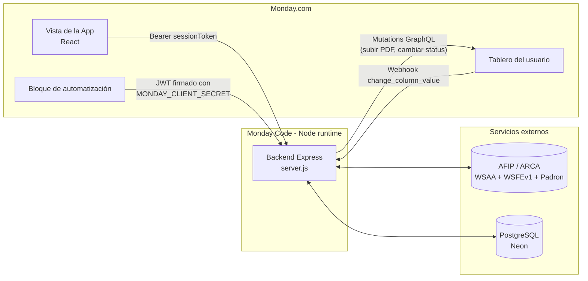
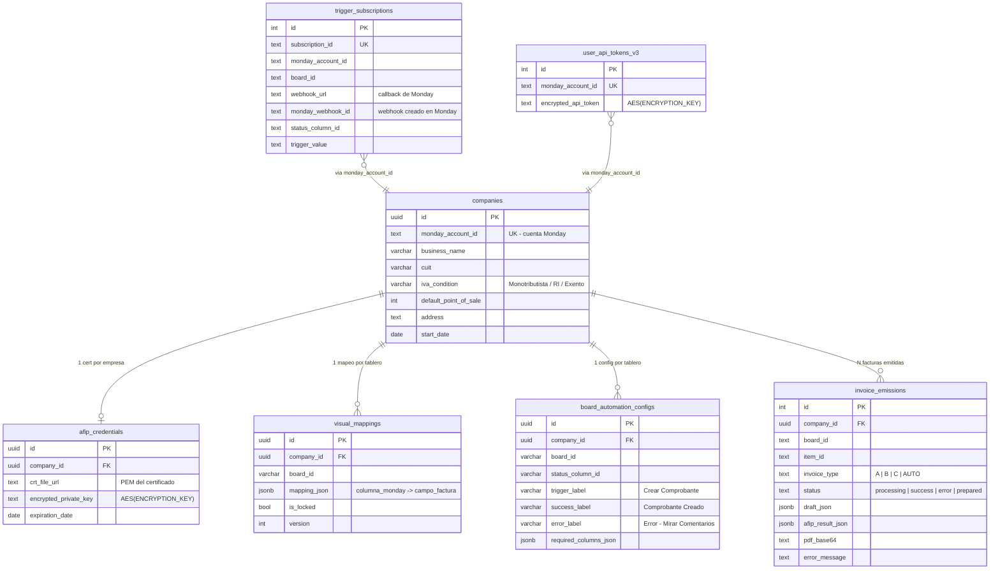
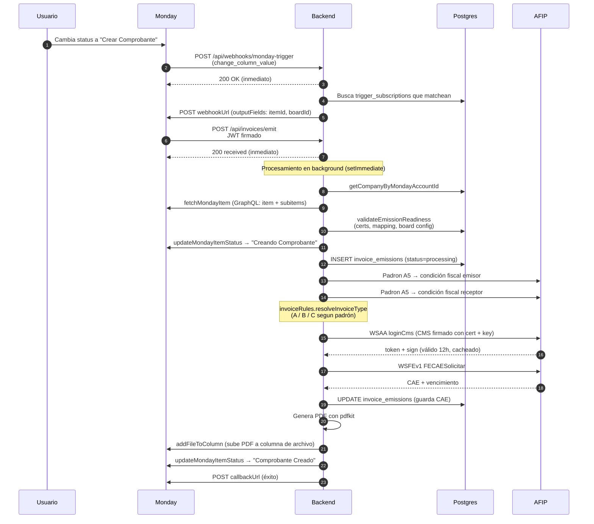

# Guía del desarrollador — App de Facturación AFIP sobre Monday

> Documento de onboarding para cualquier persona que abra este repo y necesite
> entender en qué consiste el proyecto, cómo está hecho y por qué, cómo
> levantarlo y dónde tocar cada cosa.

---

## 1. ¿De qué se trata esto?

Es una **app nativa de Monday.com** que permite a un usuario emitir **facturas
electrónicas AFIP** (Argentina) directamente desde un tablero de Monday. El
usuario configura sus datos fiscales y certificados una sola vez dentro de la
app; después, cada vez que un ítem del tablero cumple una condición (por
defecto: mover el estado a "Crear Comprobante"), el backend consulta AFIP,
emite la factura, genera el PDF y lo pega como adjunto en el mismo ítem.

En la práctica, reemplaza el flujo manual de "mirá el cliente, abrí el
facturador de AFIP, cargá todo a mano, bajá el PDF, subílo al CRM" por un solo
click dentro de Monday.

**La app se despliega sobre Monday Code** (el runtime serverless propio de
Monday). Tiene dos piezas que viven en repos independientes dentro del mismo
workspace:

- [frontend-repo/](frontend-repo/) — React + Vite. Es la UI de configuración
  que ve el usuario dentro del tablero.
- [backend-repo/](backend-repo/) — Node.js + Express. Recibe los webhooks de
  Monday, habla con AFIP y sirve el frontend como estático.

---

## 2. Stack técnico

| Capa | Tecnología | Por qué |
|---|---|---|
| Frontend | React 18 + Vite | Estándar de Monday UI. Vibe (`monday-ui-react-core`) da los componentes con el look & feel de Monday. |
| Comunicación con Monday | `monday-sdk-js` | Autenticación basada en `sessionToken` que se refresca cada request (duran ~30s). |
| Backend | Node.js + Express 5 | Monday Code corre Node estándar (no serverless lambdas). Express es lo más liviano para exponer los webhooks + API REST. |
| Base de datos | PostgreSQL (Neon) | Tenencia multi-cuenta, datos fiscales sensibles. Neon da SSL y branching. |
| SDK Monday Code | `@mondaycom/apps-sdk` | Inyecta env vars y secrets del Developer Center en `process.env`. |
| Cripto | `crypto-js` (AES) + `node-forge` | AES para cifrar la private key AFIP antes de persistir. `forge` para firmar el CMS que pide WSAA. |
| PDF | `pdfkit` | PDF de la factura en memoria (bufer), se sube directo a la columna de archivo de Monday. |
| AFIP | Fetch + SOAP manual | No usamos librerías de terceros para WSAA/WSFE: los endpoints son simples y los paquetes de la comunidad están desactualizados. |

**Lenguaje**: JavaScript en todo (sin TypeScript). El backend usa CommonJS
(`require`), el frontend ESM (módulos nativos de Vite).

---

## 3. Arquitectura en 30 segundos



**Dos rutas de entrada al backend:**

1. **UI** — el usuario abre la vista de la app dentro del tablero para
   configurar datos fiscales, subir certificados o mapear columnas. Cada
   request lleva un `sessionToken` fresco que el backend valida contra
   `MONDAY_CLIENT_SECRET`.
2. **Automatización** — cuando el usuario cambia el estado de un ítem a
   "Crear Comprobante", Monday dispara el bloque de automatización, que llama
   al backend con un JWT firmado. El backend emite la factura en background y
   devuelve el resultado por `callbackUrl`.

---

## 4. Base de datos

### 4.1 Diagrama



### 4.2 Por qué este diseño

- **`companies` es el eje**. Todo se ata a una company via `company_id`, y la
  company se resuelve por `monday_account_id`. Así una misma instalación de la
  app sirve a múltiples cuentas de Monday sin mezclar datos.
- **`afip_credentials` separada de `companies`** porque la private key se
  cifra en reposo y conviene tener controlado el acceso a esa tabla
  puntualmente (auditoría, rotación de clave).
- **`visual_mappings` guarda el mapeo columna→campo por tablero**. Se guarda
  como `jsonb` porque el set de campos evoluciona y no queremos migrar la
  tabla cada vez que sumamos un campo nuevo (ej: se agregó
  `fecha_vto_pago`, `alicuota_iva` sin tocar el schema).
- **`board_automation_configs` separada del mapping** porque la config del
  trigger (qué columna de status, qué labels) es una preocupación distinta
  del mapping de campos. El mapping sirve tanto para la emisión manual como
  para la automatizada; la config del trigger solo aplica a la automatizada.
- **`invoice_emissions` usa un unique compuesto (`company_id, board_id, item_id, invoice_type`)**
  para garantizar idempotencia: si Monday reintenta el mismo trigger dos
  veces, no facturamos dos veces. Guarda `draft_json`, `afip_result_json` y
  `pdf_base64` para poder re-imprimir sin re-emitir.
- **`trigger_subscriptions`** existe porque el flujo de Monday Custom Triggers
  requiere que guardemos el `webhookUrl` que nos manda Monday al suscribirse,
  y el `monday_webhook_id` del webhook que creamos nosotros en el tablero
  (para poder eliminarlo en el unsubscribe).
- **`user_api_tokens_v3`** existe porque el `shortLivedToken` que viene en el
  JWT de la automatización dura poco; para operaciones diferidas (subir PDF
  minutos después) necesitamos un token de usuario persistente que
  guardamos cifrado. El sufijo `_v3` es porque hubo dos esquemas previos
  abandonados.
- **Tipos mixtos (`uuid` en tablas viejas, `integer serial` en tablas nuevas)**:
  las tablas de config usan `uuid` porque permiten generar IDs en cliente
  antes de insertar; las tablas de logs/suscripciones usan serial porque son
  solo backend y el orden temporal del ID ayuda a debuggear.

> **Importante**: las tablas se crean on-the-fly con `ensure*Table()` desde el
> backend, no hay sistema de migraciones. Al agregar una columna nueva, hoy
> se hace `ALTER TABLE` manual en Neon. Esto es deuda técnica conocida.

---

## 5. Cómo funciona hoy

### 5.1 El tablero que espera la app

La app está diseñada para un **tablero con una estructura específica**. Los
IDs de columnas están hardcoded en [TEMPLATE_MAPPING](frontend-repo/src/App.jsx#L76-L91)
para que, cuando el usuario instala la app a partir de la plantilla del
marketplace, el auto-mapping funcione sin configuración.

**Columnas del ítem (cabecera de factura):**

| Label | Column ID | Tipo | Obligatorio |
|---|---|---|---|
| Status | `status` | status | ✓ (trigger) |
| Fecha de Emisión | `date` | date | ✓ |
| CUIT / DNI Receptor | `numeric_mm0yadnb` | numeric | ✓ |
| Condición de Venta | `dropdown_mm2ged22` | dropdown | — |
| Fecha Servicio Desde | `date_mm2gyjvw` | date | Si hay servicios |
| Fecha Servicio Hasta | `date_mm2g8n2n` | date | Si hay servicios |
| Fecha Vto. Pago | `date_mm2gp00f` | date | Si hay servicios |

**Subítems (líneas de la factura):**

| Label | Column ID | Tipo | Obligatorio |
|---|---|---|---|
| Concepto / Detalle | `name` | text | ✓ |
| Cantidad | `numeric_mm1srkr2` | numeric | ✓ |
| Precio Unitario | `numeric_mm1swnhz` | numeric | ✓ |
| Prod / Serv | `dropdown_mm2fyez4` | dropdown | ✓ (define concepto AFIP) |
| Unidad de Medida | `dropdown_mm2gk2mv` | dropdown | — |
| Alícuota IVA % | `dropdown_mm2g198w` | dropdown (0/2.5/5/10.5/21/27) | — |

Si el tablero no usa la plantilla, el usuario puede **mapear manualmente** las
columnas desde la sección "Mapeo Visual" de la app. El resultado se guarda en
`visual_mappings.mapping_json`.

### 5.2 La vista de la app (frontend)

La UI tiene tres secciones navegables, cada una con un candado de
"bloquear/modificar" para evitar cambios accidentales:

1. **Datos Fiscales** — razón social, CUIT, condición IVA (RI / Monotributo /
   Exento), punto de venta, fecha de inicio de actividades, dirección. Se
   persiste en `companies`.
2. **Certificados ARCA** — subida de `.crt` y `.key` generados en AFIP.
   Multer los recibe en memoria, se cifra la key con AES (`ENCRYPTION_KEY`)
   y se guarda en `afip_credentials`. Nunca toca disco.
3. **Mapeo Visual** — un formulario que presenta una "factura modelo" y deja
   al usuario asignar cada campo a una columna del tablero. Detecta si el
   tablero es de plantilla y pre-completa el mapping.

### 5.3 Flujo de emisión completo

Este es el camino feliz cuando el usuario cambia el status de un ítem a
"Crear Comprobante":



**Puntos no triviales del flujo:**

- **Responder 200 rápido es obligatorio**. Monday exige que respondamos en
  pocos segundos; por eso todo se procesa en `setImmediate()` y notificamos
  el resultado por `callbackUrl` cuando termina.
- **Dos saltos: webhook → subscription → automation**. Monday no nos llama
  directo cuando cambia una columna: primero tenemos que estar suscriptos
  a un custom trigger (`trigger_subscriptions`) y crear un webhook en el
  tablero; cuando el webhook nos avisa del cambio, nosotros decidimos si
  matchea y recién ahí llamamos al `webhookUrl` que Monday nos dio en la
  suscripción, lo que dispara el bloque de automatización.
- **Tipo de factura autodeterminado**. Si el usuario no forzó un tipo, el
  padrón AFIP del emisor + receptor decide:
  RI→RI = A, RI→CF = B, Monotributo = C. Lógica en
  [invoiceRules.js](backend-repo/src/modules/invoiceRules.js).
- **Idempotencia**. La constraint `UNIQUE (company_id, board_id, item_id, invoice_type)`
  en `invoice_emissions` hace que el segundo intento con CAE ya emitido
  devuelva 409 sin volver a facturar.
- **Persistencia en dos pasos**. Apenas AFIP devuelve CAE lo persistimos;
  si el PDF o el upload a Monday fallan después, el CAE no se pierde.
- **Errores amigables**. Si algo falla, [buildErrorComment](backend-repo/src/server.js#L2918)
  traduce el error técnico a un HTML con "Causa" + "Cómo solucionarlo" y lo
  publica como update en el ítem. Además cambia el status a
  "Error - Mirar Comentarios".

---

## 6. Estructura del código

```
.
├── frontend-repo/
│   └── src/
│       └── App.jsx              ← TODA la UI en un solo archivo (~1.400 líneas)
│
├── backend-repo/
│   ├── src/
│   │   ├── server.js            ← TODO el backend (~3.150 líneas)
│   │   ├── db.js                ← pool de Postgres
│   │   ├── config.js            ← endpoints AFIP (prod/homo) + constantes
│   │   └── modules/
│   │       ├── afipAuth.js      ← WSAA: TRA, firma CMS, caché de tokens
│   │       ├── afipPadron.js    ← consulta de padrón A5
│   │       └── invoiceRules.js  ← qué tipo de factura corresponde
│   ├── public/                  ← build del frontend copiado acá
│   └── .env                     ← local only
│
└── ARCHITECTURE.md              ← este documento
```

**Una observación honesta:**

- `server.js` y `App.jsx` son archivos gigantes. No es por gusto: el MVP
  se priorizó sobre la modularización. Si vas a tocar algo grande conviene
  dividirlos. Ver sección 9. En particular, la generación de PDF vive hoy
  inline en `server.js` (`generateFacturaCPdfBuffer`, usa `pdfkit`) y es un
  candidato natural a extraer a `modules/pdfInvoice.js`.

---

## 7. Variables de entorno y secretos

En Monday Code se configuran desde `mapps` CLI o el Developer Center. En
local, `.env` dentro de cada repo.

**Backend** ([backend-repo/.env](backend-repo/.env)):

| Variable | Tipo | Qué es |
|---|---|---|
| `DATABASE_URL` | env | Connection string de Neon. |
| `PORT` | env | Default 3001. |
| `AFIP_ENV` | env | `homologation` o `production`. |
| `PADRON_CUIT` | env | CUIT habilitado para consultar padrón (el único que AFIP autorizó; el de Martín). |
| `PADRON_COMPANY_ID` | env | UUID de esa company en `companies`. |
| `ENCRYPTION_KEY` | **secret** | Clave AES para cifrar private keys AFIP y tokens Monday. |
| `MONDAY_CLIENT_SECRET` | **secret** | Verifica los JWT de los bloques de automatización. |
| `MONDAY_SIGNING_SECRET` | **secret** | Idem (fallback). |

Las que dicen **secret** se cargan via `SecretsManager` del SDK de Monday
Code (ver [server.js:19-32](backend-repo/src/server.js#L19-L32)).

**Frontend** ([frontend-repo/.env](frontend-repo/.env)):

| Variable | Qué es |
|---|---|
| `VITE_BACKEND_URL` | Opcional. En Monday Code queda `/api` relativo. En local apunta a `http://localhost:3001/api`. |

---

## 8. Levantar en local y deployar

**Local:**

```bash
# Terminal 1 — backend
cd backend-repo && npm install && npm run dev

# Terminal 2 — frontend
cd frontend-repo && npm install && npm run dev
```

El frontend detecta `hostname === "localhost"` y apunta al backend en
`http://localhost:3001/api`.

**Limitación local**: los bloques de automatización de Monday no pueden
llegar a `localhost`. Para testear el flujo completo hay que deployar a
Monday Code o usar un túnel tipo ngrok + registrar la URL pública en el
Developer Center.

**Deploy a Monday Code:**

```bash
# 1. Build del frontend
cd frontend-repo && npm run build

# 2. Copiar el build al backend (script preexistente)
cd ../backend-repo && npm run copy-frontend

# 3. Push a Monday Code
mapps code:push
```

El backend sirve estos estáticos desde [backend-repo/public/](backend-repo/public/).
El `copy-frontend` del package.json del backend automatiza el paso 2.

---

## 9. Deuda técnica conocida y puntos abiertos

Si vas a trabajar acá por más de un par de días, estos son los focos que
conviene tener en el radar:

1. **No hay sistema de migraciones**. Las tablas se crean con `ensure*Table()`
   y las columnas nuevas se agregan con `ALTER TABLE` manual. Candidato:
   `node-pg-migrate` o similar.
2. **`server.js` y `App.jsx` son monolitos**. Conviene separar por dominio
   (rutas de config vs rutas de emisión vs clientes de AFIP).
3. **No hay tests**. Ni unitarios ni E2E. La librería de reglas
   (`invoiceRules.js`) es un buen primer candidato para unit tests.
4. **PDF fiscal**: la plantilla actual es funcional pero minimalista. No
   tiene código QR AFIP ni el detalle de vencimiento del CAE prolijo.
5. **PDF generado inline en `server.js`**. `generateFacturaCPdfBuffer` usa
   `pdfkit` y vive dentro del archivo grande. Conviene extraerlo a
   `modules/pdfInvoice.js` cuando se haga la división del monolito.
6. **Padrón habilitado para un solo CUIT**. AFIP solo autorizó consultas
   desde el CUIT de Martín (`PADRON_CUIT`). Si otra cuenta instala la app y
   quiere resolver padrón, hoy se usa ese CUIT como "proxy". Cuando la app
   crezca, cada cuenta debería tener su propio padrón habilitado.
7. **Sin OAuth real**. Guardamos `user_api_tokens_v3` ciffrados, pero
   generarlos hoy requiere pasos manuales. Un flujo OAuth completo de Monday
   simplificaría el onboarding.
8. **Manifest de Monday Code (`mapps.json`)**: hoy la config del bloque de
   automatización y del trigger vive en el Developer Center. No está
   versionada en el repo. Vale la pena migrarla a un manifest.
9. **Logs**: hoy es `console.log` disperso. Se lee en el Developer Center →
   Registros. Falta un nivel de log estructurado (JSON) y correlación por
   `actionUuid` para debuggear flujos asíncronos.
10. **Homologación AFIP es inestable**. Es normal recibir `HTTP 500 / Zero length BigInteger`
    durante caídas de sandbox. El catálogo de errores del backend ya distingue
    varios casos; si ves ese error específico, revisá primero
    `https://www.afip.gob.ar/ws/` antes de debuggear tu código.

---

## 10. Glosario mínimo AFIP

- **WSAA** (Web Service de Autenticación y Autorización): te da un `token` y
  `sign` que después usás en los demás servicios. Dura 12hs.
- **WSFEv1** (Web Service de Facturación Electrónica): el que emite el CAE.
- **Padrón A5**: consulta de condición fiscal de un CUIT. Requiere estar
  habilitado como consultor para ese CUIT.
- **CAE**: Código de Autorización Electrónico. Es el número que AFIP devuelve
  cuando aprueba la factura. Sin CAE la factura no es válida.
- **TRA**: Ticket de Requerimiento de Acceso. XML que firmamos con la clave
  privada y mandamos a WSAA para pedir el token.
- **CMS**: Cryptographic Message Syntax (PKCS#7). Es el formato del TRA
  firmado que espera WSAA.
- **Concepto AFIP**: `1` productos, `2` servicios, `3` ambos. Define si la
  factura necesita fechas de período de servicio.
- **Condición IVA**: Responsable Inscripto, Monotributista, Exento,
  Consumidor Final. Define qué tipo de factura corresponde.

---

_Última actualización: abril 2026. Si tocás algo estructural, mantené este
documento al día._
